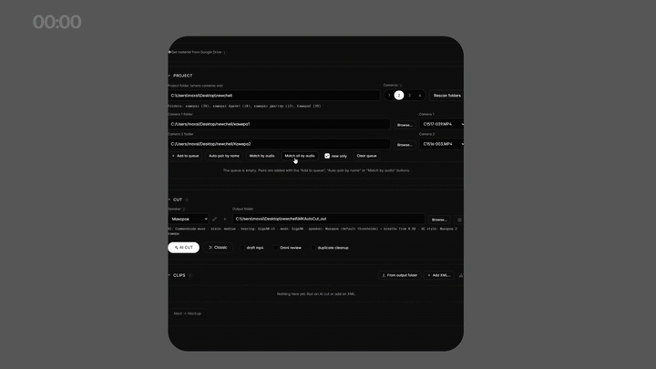

# Reelsi

Reelsi is a local editing assistant for talking-head video. AI cuts footage by content and builds ready-to-edit projects for Adobe Premiere Pro and After Effects. Nothing is uploaded to remote servers, except text sent to your chosen cloud AI provider.

> Russian version: [README.ru.md](README.ru.md).



## What it does

- **Multicam audio sync**: aligns 1–4 camera tracks automatically by audio correlation.
- **Semantic AI cutting**: cuts speech by transcript content using local LM Studio or cloud providers, with customizable cutting stages.
- **Word-level subtitles**: builds animated graphic subtitles with per-word highlights and plain `.srt` files.
- **B-roll inserts**: matches assets from your local library by meaning or generates images and video on demand.
- **Word highlights and intro**: detects key phrases for emphasis and creates animated intro title cards.
- **In-browser preview**: renders the full scene layout before export with direct drag-and-drop adjustments.
- **Premiere and After Effects export**: generates Premiere XML and After Effects scripts, with batch rendering without opening AE.
- **DaVinci Resolve export**: exports timeline projects to `.drp` format.
- **Google Drive download**: fetches footage directly from shared links via `rclone`.

## Requirements

Tested only on Windows 11 with an NVIDIA GPU and Adobe After Effects / Premiere Pro. Other platforms are untested; porting notes: [docs/PLATFORMS.md](docs/PLATFORMS.md).

- Python 3.10 and ffmpeg in PATH.
- NVIDIA GPU with CUDA support.
- Adobe After Effects for project assembly and rendering.
- LM Studio locally or an API key for a cloud LLM provider.
- Optional tools: `rclone` (Google Drive downloads), `yt-dlp` (music).
- Subtitle templates use SF Pro; rebuild them for another font via `python tools/harvest_good.py "path/to/reference.xml"`.

## Installation

Run all commands from the `reelsi/` folder.

Run the automated installer:

```bash
powershell -ExecutionPolicy Bypass -File install.ps1
```

Or install manually:

```bash
pip install torch==2.5.1 torchaudio==2.5.1 torchvision==0.20.1 --index-url https://download.pytorch.org/whl/cu121
pip install -r requirements.txt
pip install -r requirements-optional.txt
```

Verify your environment with `python doctor.py`, which checks installed tools, GPU acceleration, and missing components.

## Quick start

Clone the repository into your workspace, next to your footage folders:

```
my_workspace/
├── reelsi/            ← this repository
├── camera1/           ← camera footage
├── camera2/
└── music/
```

Start the web interface:

```bash
python webui.py
```

Open http://127.0.0.1:5001 to run the three-step wizard (Cut, Markup, After Effects). On first run, `webui.py` creates `insertlib.json`, `styles/`, and `speakers/` from `examples/*.example.json`. Configure AI keys via ⚙ in the UI (stored in gitignored `ai_config.json`).

CLI commands:

```bash
python reelsi.py --cams 2     # two cameras
python reelsi.py --single     # single camera
python reelsi.py --no-cut     # subtitles only
```

## Known limitations

- Verified only on Windows 11 with NVIDIA GPU and Adobe applications.
- Premiere XML and `.drp` export contain known issues documented in [docs/KNOWN_ISSUES.md](docs/KNOWN_ISSUES.md).
- Beta status: configuration and project schemas may change between releases.

## Documentation

- [docs/ARCHITECTURE.md](docs/ARCHITECTURE.md) — detailed architecture (Russian).
- [docs/ARCHITECTURE.en.md](docs/ARCHITECTURE.en.md) — architecture overview (English).
- [.github/CONTRIBUTING.md](.github/CONTRIBUTING.md) — contribution guidelines.
- [CHANGELOG.md](CHANGELOG.md) — release history.

## License

Reelsi is licensed under AGPL-3.0-or-later. You may modify and redistribute it under the same license, or contact the author for commercial licensing.

- Third-party inventory: [NOTICE](NOTICE)
- Trademark policy: [docs/TRADEMARK.md](docs/TRADEMARK.md)
- Security policy: [.github/SECURITY.md](.github/SECURITY.md)

Third-party components:
- Adobe, Premiere Pro, and After Effects are trademarks of Adobe Inc., not affiliated with this project.
- Robust Video Matting is licensed under GPL-3.0 and downloaded when rotoscoping is used.
- GigaAM and Qwen2.5-Omni model weights are governed by their respective licenses.
- SF Pro font is not distributed with this repository.
- `yt-dlp`: users are responsible for downloaded media content.
