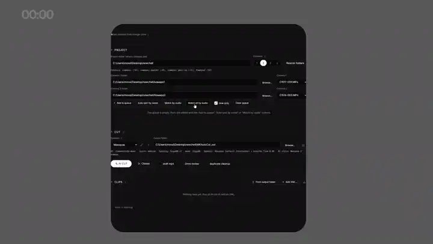

# Reelsi

[](https://github.com/mxmlab/reelsi/actions/workflows/ci.yml)

> Русская версия. English: [README.md](README.md).

Локальный помощник монтажа говорящей головы. ИИ режет видео по содержанию и собирает готовые проекты для Adobe Premiere Pro и After Effects. Все вычисления происходят на вашей машине, наружу отправляется только текст к выбранному облачному провайдеру ИИ.



## Что делает

- **Синхронизация камер по звуку**: автоматическое сведение нескольких камер по аудиодорожкам. Рассчитана на несколько камер (до четырёх), проверена на двух.
- **ИИ-нарезка по смыслу**: нарезка речи по пословному транскрипту через локальную LM Studio или облачные модели с выбором этапов нарезки.
- **Пословные субтитры**: анимированная графика субтитров с подсветкой активных слов и экспорт в `.srt`.
- **Вставки по смыслу**: подбор видео и картинок из локальной базы по смыслу или генерация нейросетями.
- **Подсветка слов и интро**: выделение ключевых фраз и сборка анимированных вступительных заголовков.
- **Предпросмотр в браузере**: интерактивный просмотр композиции до экспорта с правкой элементов перетаскиванием.
- **Экспорт в Premiere и After Effects**: генерация Premiere XML и скриптов After Effects с пакетным рендером без запуска интерфейса AE.
- **Экспорт в DaVinci Resolve**: экспорт смонтированной последовательности в проект `.drp`. Проверенный от начала до конца путь один — After Effects; экспорт в Premiere и Resolve работает, но проверен меньше (см. «Ограничения»).
- **Скачивание с Google Drive**: загрузка исходных материалов по ссылке через `rclone`.

## Системные требования

Проверено только на Windows 11 с видеокартой NVIDIA и Adobe After Effects / Premiere Pro. Другие платформы не проверялись; заметки о переносе — [docs/PLATFORMS.md](docs/PLATFORMS.md).

- Python 3.10 и ffmpeg в переменной PATH.
- Видеокарта NVIDIA с поддержкой CUDA.
- Adobe After Effects для финальной сборки и рендера графики.
- LM Studio для локальной работы или API-ключ облачного провайдера.
- Опциональные утилиты: `rclone` (скачивание с Google Drive), `yt-dlp` (музыка).
- Шаблоны субтитров используют шрифт SF Pro; пересборка под другой шрифт: `python tools/harvest_good.py "path/to/reference.xml"`.

## Установка

Все команды — из папки клона `reelsi/`.

Обычная установка (`pip install .` или `pipx`) не поддерживается: шаблоны, статика и личные файлы пользователя живут в папке клона.

Автоматическая установка: `install.ps1` для Windows, `install.sh` для macOS и Linux:

```bash
powershell -ExecutionPolicy Bypass -File install.ps1   # Windows
bash install.sh                                        # macOS и Linux
```

Оба установщика ставят только зависимости: команды `reelsi`, `reelsi-webui` и `reelsi-doctor` появляются после `pip install -e .`. Python и ffmpeg они не ставят — `install.sh` для этого нужен системный `python3`, и оба останавливаются и говорят, чего не хватает, вместо того чтобы ставить это самим.

Ручная установка:

```bash
pip install torch==2.5.1 torchaudio==2.5.1 torchvision==0.20.1 --index-url https://download.pytorch.org/whl/cu121
pip install -r requirements.txt
pip install -r requirements-optional.txt
```

Установка из клона в режиме editable (регистрирует команды `reelsi`, `reelsi-webui`, `reelsi-doctor`):

```bash
pip install -e .
# с опциональными зависимостями:
pip install -e ".[optional]"
```

Проверка окружения выполняется командой `python doctor.py` (или `reelsi-doctor`): скрипт проверяет компоненты, GPU-ускорение и выводит инструкции по устранению неполадок.

## Быстрый старт

Клонируйте репозиторий внутрь рабочей папки, рядом с папками материала:

```
my_workspace/
├── reelsi/            ← этот репозиторий
├── camera1/           ← видео с камер
├── camera2/
└── music/
```

Запустите веб-интерфейс:

```bash
python webui.py          # или: reelsi-webui
```

Откройте адрес http://127.0.0.1:5001: мастер из трёх шагов провёдет нарезку, разметку и экспорт в After Effects. При первом запуске `webui.py` автоматически создаёт файлы `insertlib.json`, `styles/` и `speakers/` из `examples/*.example.json`. Ключи ИИ задаются через ⚙ в интерфейсе и хранятся в `ai_config.json` вне git.

Команды консоли:

```bash
python reelsi.py --cams 2     # две камеры (после pip install -e .: reelsi --cams 2)
python reelsi.py --single     # одна камера
python reelsi.py --no-cut     # только субтитры
```

## Ограничения

- Проверено только на Windows 11 с видеокартой NVIDIA и приложениями Adobe.
- Экспорт в Premiere XML и DaVinci `.drp` содержит известные дефекты: [docs/KNOWN_ISSUES.md](docs/KNOWN_ISSUES.md).
- Статус бета-версии: структуры настроек и проектов могут меняться между релизами.

## Документация

- [docs/FEATURES.ru.md](docs/FEATURES.ru.md) — все возможности по шагам
- [docs/ARCHITECTURE.md](docs/ARCHITECTURE.md) — подробная архитектура на русском языке.
- [docs/ARCHITECTURE.en.md](docs/ARCHITECTURE.en.md) — обзор архитектуры на английском языке.
- [.github/CONTRIBUTING.md](.github/CONTRIBUTING.md) — руководство по участию в разработке.
- [CHANGELOG.md](CHANGELOG.md) — история изменений.

## Разработка

Установите зависимости разработки и настройте git-хуки:

```bash
pip install -r requirements-dev.txt
pre-commit install
```

Запуск тестов и линтеров локально (CI выполняет те же проверки):

```bash
python -m pytest tests -q
ruff check .
mypy
```

## Лицензия

Reelsi распространяется под лицензией AGPL-3.0-or-later. Вы можете свободно использовать, изменять и распространять код на тех же условиях; по вопросам коммерческой лицензии обращайтесь к автору.

- Сторонние компоненты: [NOTICE](NOTICE)
- Товарные знаки: [docs/TRADEMARK.md](docs/TRADEMARK.md)
- Политика безопасности: [.github/SECURITY.md](.github/SECURITY.md)

Лицензии сторонних решений:
- Adobe, Premiere Pro и After Effects — товарные знаки Adobe Inc., проект с ними не аффилирован.
- Robust Video Matting лицензирован под GPL-3.0 и загружается только при использовании ротоскопирования.
- Веса моделей GigaAM и Qwen2.5-Omni распространяются под собственными лицензиями.
- Шрифт SF Pro не распространяется в составе репозитория.
- `yt-dlp`: ответственность за скачиваемые материалы несёт пользователь.
